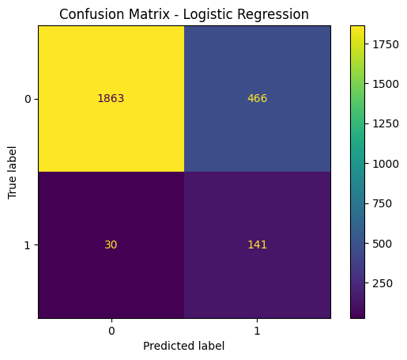
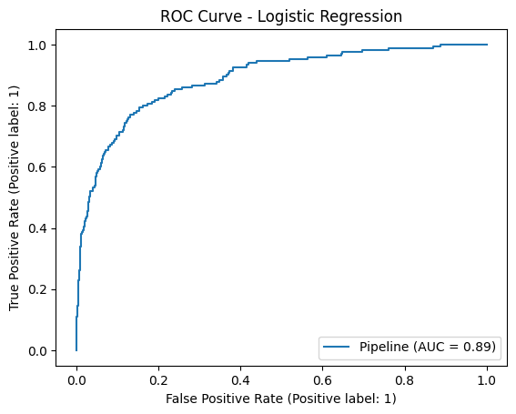

# Bank Fraud Detection System

## Project Overview
This project builds a machine learning model to detect potentially fraudulent banking transactions. Fraud detection is highly relevant to financial services because it helps reduce financial losses, improve customer trust, and support risk teams with faster decision-making.

## Business Problem
Banks process thousands or millions of transactions daily. Manual fraud review is slow and expensive. This project uses transaction features to classify whether a transaction is likely to be fraudulent.

## Dataset
This project uses a synthetic transaction dataset generated inside the notebook/script. This avoids data privacy issues while still demonstrating a realistic fraud detection workflow.

## Tools & Technologies
- Python
- Pandas
- NumPy
- Scikit-learn
- Matplotlib
- Joblib

## ML Workflow
1. Generate synthetic transaction data
2. Perform exploratory data analysis
3. Handle class imbalance
4. Train classification models
5. Evaluate using accuracy, precision, recall, F1-score, ROC-AUC, and confusion matrix
6. Save the best model

## Why This Project Matters for Banking
Fraud detection is a real-world banking problem where recall is especially important because missing fraud cases can be costly. This project demonstrates the ability to build data-driven risk models and explain results clearly.

## How to Run
```bash
pip install -r requirements.txt
python fraud_detection.py
```

## Expected Output
The script will:
- Create a synthetic fraud dataset
- Train Logistic Regression and Random Forest models
- Print evaluation metrics
- Save the best model as `fraud_detection_model.pkl`
- Save confusion matrix and ROC curve images

- ## My Key Learning

This project helped me understand how fraud detection is different from normal classification problems because the dataset is imbalanced. I learned that recall is very important because missing real fraud cases can be costly for a bank.

## Result Interpretation

Logistic Regression gave strong recall and ROC-AUC. Even though Random Forest had higher accuracy, Logistic Regression was more suitable because it detected more fraud cases.

## Output Visuals

### Confusion Matrix


### ROC Curve

