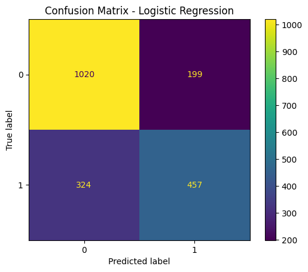

# Customer Churn Prediction

## Project Overview
This project predicts whether a customer is likely to leave a bank or financial service provider. Customer churn prediction helps businesses identify at-risk customers early and design retention strategies.

## Business Problem
Losing customers is expensive. A churn prediction model can help customer success, marketing, and relationship management teams focus on customers most likely to leave.

## Dataset
This project uses a synthetic customer dataset generated inside the script. It includes features such as tenure, monthly charges, complaints, product usage, and customer support interactions.

## Tools & Technologies
- Python
- Pandas
- NumPy
- Scikit-learn
- Matplotlib
- Joblib

## ML Workflow
1. Generate synthetic customer data
2. Explore churn patterns
3. Prepare features and target variable
4. Train classification models
5. Evaluate performance
6. Save model and visualisations

## Why This Project Matters for Banking
Banks and fintech companies need to understand customer behaviour. This project shows how data can support customer retention, reduce churn, and improve business decision-making.

## How to Run
```bash
pip install -r requirements.txt
python churn_prediction.py
```

## Expected Output
The script will:
- Generate a customer churn dataset
- Train Logistic Regression and Random Forest models
- Print evaluation metrics
- Save the best model as `churn_prediction_model.pkl`
- Save feature importance and confusion matrix images

- ## My Key Learning

This project helped me understand how customer behaviour data can be used to predict churn. I learned how features such as complaints, missed payments, support calls and online banking activity can influence whether a customer may leave.

## Business Use Case

A bank or financial service provider can use churn prediction to identify high-risk customers early and offer better support or retention offers.

## Output Visuals

### Confusion Matrix


### Feature Importance

